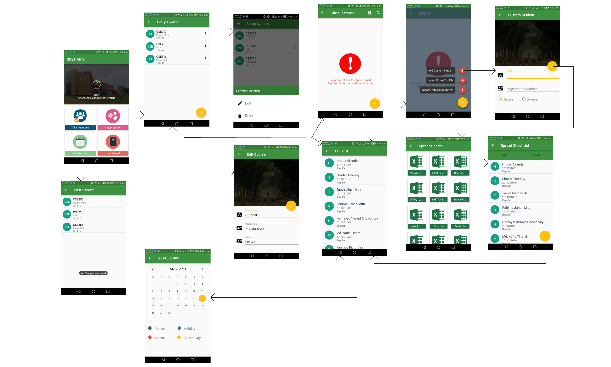

# SUST-AMS
This app is still under development. The key feature of this app is to provide the facilities of taking attendance and 
manage the records. The app also supports Importing Student List from Google Spread Sheet, Exporting Attendance record as CSV
file. It also provide a graphical visulization through Pie Chart about the attendance record for a individual student under 
individual course. Following is some of the screen shots of the app. 
